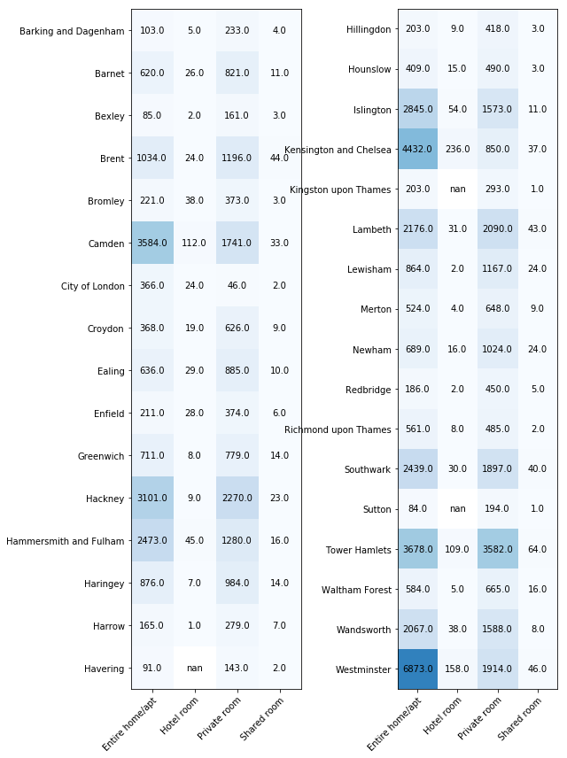

# UdacityProject-Blog
# How does the Airbnb London listings look like across boroughs?

photo credit:https://www.talk2solicitors.co.uk/blog/is-it-legal-to-rent-out-your-home-on-airbnb-in-london/

## Introduction

Airbnb, operating as an online marketplace for arranging or offering lodging, has become a popular choice for tourists or even business travellers in the recent years. In this article, we are going to analyse real data of Airbnb listings in one of the world's most popular travel destinations, London. We will focus on the availability, room types and prices across London Boroughs.

The data used is the listings data downloaded from the Inside Airbnb website as of at 05/Nov/2019.

## Part 1: Where are the listings based in London?

Here you can see the breakdown of the number of listings posted on the Airbnb website by London boroughs.

In total, there are 76,613 London listings which covers almost all London boroughs. We can see the Top 2 boroughs in terms of the number of listings are __Westminster__ and __Tower Hamlets__, followed by Kensington and Chelsea, Camden and Hackney. Westminster is close to most of the London tourist attractions and hence popular with tourists. Though Tower Hamlets is a bit further away, it has plenty of residential properties and good transportation links into central London. Both boroughs are relatively large in terms of size among central boroughs. 

## Part 2: What are the room types across different locations?

Number of listings by roome type in each London Borough

Overall, Entier home/flat (57%) and Private room (41%) dominate the roome types listed in London. More Entier home/flat are available in central London whereas more privte rooms could be found in Zone 3 outwards. 

Also if we compare the ratio between entire home/flat and private room listed, with average number of listings per Host in each borough, we can see that in general where the ratio is high/higher (i.e. more entire home/flat listed than private room), each host tend to have multiple(20+) listings on average, especially in Kensington and Chelsea and Hammersmith and Fulham. These listings are likely to be running as business rather than private homes. 

## Part 3: What about the price and availability ranges across locations?

Price Range for Entire home/flat by borough

Price Range for Private room by borough

The listings for each borough covers a wide price range with quite a number of expensive 'outliers', especially for Entier home/flat. We can see a few extremelly expensive listings in areas like Westminster and Camden which covers London's most prestgious places.

Availability Range by borough

In terms of availability, Hackey, Islington and Lambeth have the lowest availability. These are all areas with high value for money - though not in central London but comparatively cheaper with easy transport links. Better to book early if intersting in staying in those areas.

## Conclusions

In this article, we took a brief look at how the Airbnb listings look like across London boroughs according to the Nov 2019 Inside Airbnb data.

   1. Plenty of home/flat/room in London are available/listed on Airbnb. Westminster has the most number of listings thanks to its closeness to a number of tourist attractions. Tower Hamlets won the silver medal. Though it is a bit further away, it has plenty of residential properties and good transportation links into central London. 
   
   
   2. Overall, Entier home/flat (57%) and private room (41%) dominate the roome types listed in London. More Entier home/flat are available in central London whereas more privte rooms could be found in Zone 3 outwards. Also in those central boroughs, it is noticed that each host tend to have multiple (20+)listings, especially in Kensington and Chelsea and Hammersmith and Fulham. These listings are likely to be running as business rather than private homes.
   
   
   3. The listings for each borough covers a wide price range with quite a number of expensive 'outliers', especially if we look at Entier home/flat. We can see a few extremelly expensive listings in areas like Westminster and Camden which covers London's most prestgious places. In terms of availability, Hackey, Islington and Lambeth have the lowest availability. These are all areas with high value for money - though not in central London but comparatively cheaper with easy transport links. 
   
To see more about this analysis, see the link to my Github available [here]().

## References 

Inside Airbnb Data as of Nov 2019: http://insideairbnb.com/get-the-data.html
